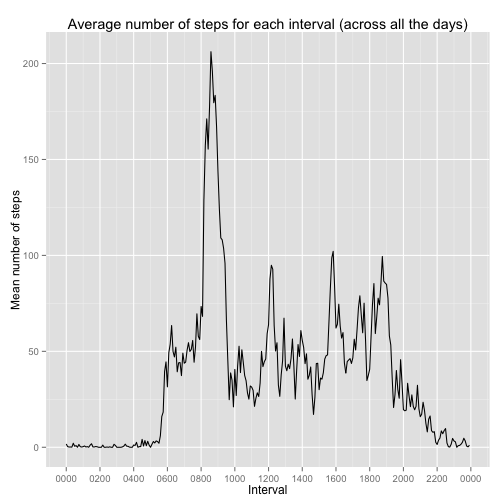
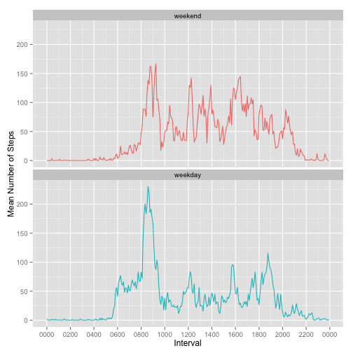

```r
library(ggplot2)
library(scales)
library(sqldf)
```

## Loading and preprocessing the data
We load the data in the _activity.csv_ file into a dataframe. Then we convert the _date_ columns values into type Date and create time values for the _interval_ column. 

__Note__: The _interval_ column contains numeric values representing times at 5 min itervals (e.g. 0 => time 00:00, 230 => time 02:30, 2305 => time 23:05). Since there are 60 minutes (and not 100) in an hour, we cannot use the numeric values directly to represent time in time series plots that we need to do. So we convert the numeric values to datetime and use the time portion in the plots. For doing this, we need to compute the hours and minutes from the numeric value.


```r
df <- read.csv('activity.csv', stringsAsFactors=FALSE)
# Convert the date strings to Date type
df$date <- as.Date(df$date)
fmt_interval <- paste(sprintf("%02d",floor(df$interval/100)), 
                      sprintf("%02d",df$interval %% 100))
df$interval <- as.POSIXct(strptime(fmt_interval,"%H %M"))
```

## What is mean total number of steps taken per day?


```r
total_steps_by_day <- aggregate(steps ~ date, data=df, FUN=sum)

hist(total_steps_by_day$steps, breaks=10,
     xlab="Daily total steps", 
     main="Frequency distribution of daily total steps")
```

 

```r
mean_daily_total_steps <- mean(total_steps_by_day$steps)
median_daily_total_steps <- median(total_steps_by_day$steps)

paste("Mean daily total steps:", mean_daily_total_steps)
```

```
## [1] "Mean daily total steps: 10766.1886792453"
```

```r
paste("Median daily total steps:", median_daily_total_steps)
```

```
## [1] "Median daily total steps: 10765"
```

## What is the average daily activity pattern?


```r
mean_steps_by_interval <- aggregate(steps ~ interval, data=df, FUN=mean)
qplot(x=mean_steps_by_interval$interval, 
      y=mean_steps_by_interval$steps,
      xlab="Interval",
      ylab="Mean number of steps",
      main="Average number of steps for each interval (across all the days)",
      geom=c("line")) + 
          scale_x_datetime(breaks = 
                             date_breaks("2 hours"),labels=date_format("%H%M"))
```

 


```r
max_row <- which.max(mean_steps_by_interval$steps)
interval_with_max_mean_steps <- mean_steps_by_interval[max_row, ]$interval
paste("Interval with the maximum mean steps:", 
      strftime(interval_with_max_mean_steps,format="%H%M"))
```

```
## [1] "Interval with the maximum mean steps: 0835"
```

## Imputing missing values

```r
missing_data_rows <- df[is.na(df$steps),]
paste("Number of rows with missing values:",nrow(missing_data_rows))
```

```
## [1] "Number of rows with missing values: 2304"
```

Replace missing step values by average of the interval corresponding to that row.

```r
m <- mean_steps_per_interval
df_part1 <- sqldf("select m.steps as steps,df.date as date,m.interval 
                  as interval from df,m where df.interval = m.interval 
                  and df.steps is null")
df_part2 <- sqldf("select steps,date,interval from df where steps 
                  is not null")
df_imputed <- rbind(df_part1,df_part2)
```

Make sure there are no rows left with missing values after imputation.

```r
paste("Number of rows with missing values after imputing:", 
      nrow(df_imputed[is.na(df_imputed$steps),]))
```

```
## [1] "Number of rows with missing values after imputing: 0"
```

We plot a histogram for the total daily steps with the imputed data. It is mostly similar to the earlier histogram other than the fact that the highest bucket has grown higher.

```r
total_steps_by_day_imputed <- aggregate(steps ~ date, data=df_imputed, FUN=sum)

hist(total_steps_by_day_imputed$steps, breaks=10,
     xlab="Daily total steps", 
     main="Frequency distribution of daily total steps")
```

 

The mean daily steps has remained the same while the median has moved up very slightly. 

```r
mean_daily_total_steps <- mean(total_steps_by_day_imputed$steps)
median_daily_total_steps <- median(total_steps_by_day_imputed$steps)

paste("Mean daily total steps:", mean_daily_total_steps)
```

```
## [1] "Mean daily total steps: 10766.1886792453"
```

```r
paste("Median daily total steps:", median_daily_total_steps)
```

```
## [1] "Median daily total steps: 10766.1886792453"
```

## Are there differences in activity patterns between weekdays and weekends?

On weekends, there is a reduction in activity in the early morning and an increase in the afternoon and late evening as compared to weekdays.


```r
df_imputed$daytype <- factor(weekdays(
  df_imputed$date) %in% c("Saturday", "Sunday"), 
  levels=c(TRUE,FALSE), 
  labels=c("weekend","weekday"))

mean_steps_by_interval_and_daytype <- aggregate(steps ~ interval+daytype, 
                                                data=df_imputed, 
                                                FUN=mean)

qplot(interval, steps, 
      data=mean_steps_by_interval_and_daytype, 
      color=daytype,
      xlab="Interval",
      ylab="Mean Number of Steps",
      geom=c("line")) +  
         facet_wrap(~daytype, ncol=1) + 
         theme(legend.position="none") +
         scale_x_datetime(breaks = 
                            date_breaks("2 hours"),labels=date_format("%H%M"))
```

 
